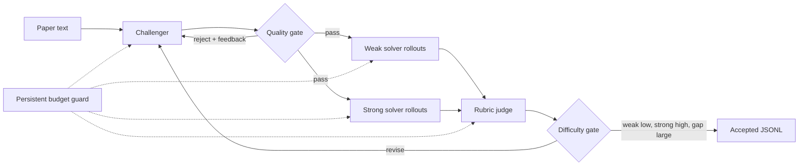

# OpenAI Autodata

[](https://github.com/PRINCE2-AI/openai-autodata/actions/workflows/tests.yml)
[](https://www.python.org/)
[](https://developers.openai.com/api/)
[](LICENSE)
[](https://github.com/PRINCE2-AI/openai-autodata/stargazers)

**A budget-aware, failure-resistant Agentic Self-Instruct pipeline for generating hard research question-answer data with the OpenAI API.**

OpenAI Autodata turns research papers into evaluated synthetic QA records. A challenger creates a difficult item and rubric, weak and strong solvers attempt it, and a judge accepts the item only when the measured difficulty gap is large enough.

> [!NOTE]
> This is an independent implementation inspired by the paper [Autodata: An agentic data scientist to create high quality synthetic data](https://arxiv.org/abs/2606.25996). It is not an official implementation and is not affiliated with the paper authors, Meta, or OpenAI.

## Why this project

Many synthetic-data scripts generate examples once and keep them. This project treats generation as a closed evaluation loop:

- **Measured difficulty:** weak and strong solvers must produce a configurable score gap.
- **Fail-closed validation:** malformed JSON, invalid rubrics, failed judges, and missing rollouts cannot create false acceptances.
- **Persistent cost control:** a local ledger resumes across restarts and preflights each request against a configurable budget.
- **Auditable output:** every round, answer, score, rejection reason, and cost estimate is saved.
- **Role-specific models:** challenger, weak solver, strong solver, and judge models can be configured independently.
- **Offline coverage:** 13 regression tests exercise budget, validation, scoring, persistence, and end-to-end control flow without API spend.

## Architecture



An item is accepted only when all three conditions hold:

```text
weak_average <= weak_max
strong_average >= strong_min
strong_average - weak_average >= gap_min
```

## Quick start

### 1. Clone and install

```bash
git clone https://github.com/PRINCE2-AI/openai-autodata.git
cd openai-autodata
python -m venv .venv
```

Windows PowerShell:

```powershell
.\.venv\Scripts\Activate.ps1
pip install -r requirements.txt
Copy-Item .env.example .env
```

macOS/Linux:

```bash
source .venv/bin/activate
pip install -r requirements.txt
cp .env.example .env
```

### 2. Configure OpenAI

Edit `.env` and set your API key. Never commit this file.

```env
OPENAI_API_KEY=your-openai-api-key
OPENAI_CHALLENGER_MODEL=gpt-5.6-luna
OPENAI_STRONG_MODEL=gpt-5.6-luna
OPENAI_JUDGE_MODEL=gpt-5.6-luna
OPENAI_WEAK_MODEL=gpt-5.4-nano
OPENAI_BUDGET_USD=50
OPENAI_BUDGET_SAFETY_USD=2
```

Model access and pricing can change. Check the current [OpenAI model catalog](https://developers.openai.com/api/docs/models) and [pricing](https://developers.openai.com/api/docs/pricing) before a large run.

### 3. Run the bundled example

The repository includes an original synthetic paper excerpt, so the first smoke test does not require downloading third-party PDFs:

```powershell
python run_batch.py --papers-dir examples --max-papers 1 --max-rounds 2 --weak-rollouts 1 --strong-rollouts 1
```

### 4. Prepare research papers

Download recent CS papers and extract their text locally:

```powershell
python src/utils/download_papers.py
python src/utils/extract_text.py
```

PDFs and extracted paper text are intentionally excluded from Git. Check each paper's license before redistributing it.

## Hard run

```powershell
python run_batch.py --max-papers 10 --max-rounds 8 --weak-rollouts 2 --strong-rollouts 2 --budget-usd 50
```

Stricter acceptance:

```powershell
python run_batch.py --weak-max 0.50 --strong-min 0.70 --gap-min 0.25
```

Key options:

| Option | Default | Purpose |
| --- | ---: | --- |
| `--max-papers` | `10` | Maximum input papers |
| `--max-rounds` | `8` | Challenger revision rounds per paper |
| `--weak-rollouts` | `2` | Weak-solver samples per item |
| `--strong-rollouts` | `2` | Strong-solver samples per item |
| `--weak-max` | `0.55` | Maximum accepted weak score |
| `--strong-min` | `0.65` | Minimum accepted strong score |
| `--gap-min` | `0.15` | Minimum strong-minus-weak gap |
| `--budget-usd` | `$50` | Total local cost-ledger cap |
| `--budget-safety-margin-usd` | `$2` | Unspent buffer below the cap |

## Outputs

Generated artifacts stay local by default:

```text
data/
|-- accepted/
|   |-- dataset.jsonl
|   `-- <paper>_accepted.json
|-- trajectories/
|   `-- <paper>_trajectory.json
`-- cost_report.jsonl
```

Each accepted dataset row contains the paper ID, context, question, reference answer, rubric, weak score, strong score, score gap, question type, and reasoning-skill tags.

The local budget tracker is a safety mechanism, not a replacement for an OpenAI project usage limit. Set a matching limit in the OpenAI dashboard because the local process cannot observe calls made by other applications.

## Tests

The complete test suite is offline and uses mocked API responses:

```powershell
python -m unittest discover -v
```

It covers:

- cached and uncached token pricing
- projected-call budget blocking
- cost-ledger resume across restarts
- JSON mode and token-usage tracking
- non-retryable budget failures
- QA and rubric validation
- weak/strong rollout failure handling
- reference-answer-aware judging
- budget-stop trajectory persistence
- accepted-dataset upserts
- end-to-end fake-agent acceptance

## Project layout

```text
openai-autodata/
|-- .github/                 # CI and dependency automation
|-- examples/                # Original, redistributable smoke-test input
|-- src/
|   |-- agents/              # OpenAI challenger, solvers, and judge
|   |-- pipeline/            # Agentic Self-Instruct loop
|   `-- utils/               # Cost tracking and paper preparation
|-- tests/                   # Offline regression suite
|-- .env.example
|-- run_batch.py
`-- requirements.txt
```

## Responsible use

Synthetic data can contain factual errors, hidden leakage, or biased grading criteria. Review accepted records before using them for training or evaluation. Do not upload private, licensed, or sensitive documents without permission.

## Roadmap

- [ ] Add OpenAI Responses API support
- [ ] Add Batch API mode for lower-cost large runs
- [ ] Add a local evaluation dashboard
- [ ] Add pluggable paper and domain adapters
- [ ] Publish reproducible benchmark results

## Contributing

Contributions are welcome. Read [CONTRIBUTING.md](CONTRIBUTING.md), keep tests offline, and never include API keys or third-party paper files in a pull request.

## License

The source code is available under the [MIT License](LICENSE). Third-party papers and datasets retain their own licenses.

If this project saves you time or gives you a useful starting point, consider starring the repository.
