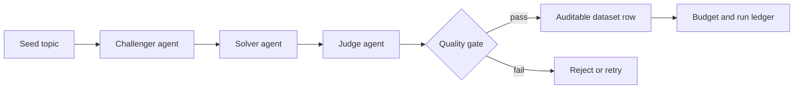

# OpenAI AutoData Case Study

## Problem

High-quality evaluation and training data for LLM systems is expensive to create manually. Naive synthetic-data generation can produce easy, duplicated, or poorly validated examples. OpenAI AutoData builds a controlled multi-agent workflow for generating harder research QA data with budget controls and validation gates.

## System Design

## Engineering Decisions

- Split generation into challenger, solver, and judge roles instead of a single prompt.
- Added persistent budget controls to prevent uncontrolled API spend.
- Used fail-closed validation so incomplete or malformed outputs are rejected.
- Stored auditable outputs for review and reproducibility.
- Kept offline tests so core behavior can be verified without API usage.

## Validation Evidence

| Signal | Result |
| --- | --- |
| Regression tests | 13 tests |
| CI | GitHub Actions workflow present |
| Provider | OpenAI API |
| Budgeting | Persistent budget guard |
| Validation | Fail-closed structured output checks |
| Output quality | Challenger/solver/judge workflow with auditable rows |

## Why It Matters For AI Engineering

This project demonstrates applied LLM engineering beyond chat: structured generation, synthetic-data quality control, API cost management, validation, reproducibility, and testable agent workflows.

## Limitations

- The project is designed for controlled portfolio-scale data generation.
- Dataset quality still depends on prompt design, review, and benchmark-specific validation.
- Production use should add larger review sets, human evaluation, and richer deduplication.

## Next Improvements

- Add benchmark-specific exports for RAG and instruction tuning.
- Add semantic deduplication using embeddings.
- Add a dashboard for budget, rejection rate, and sample quality.
- Add model-comparison runs across OpenAI models.
